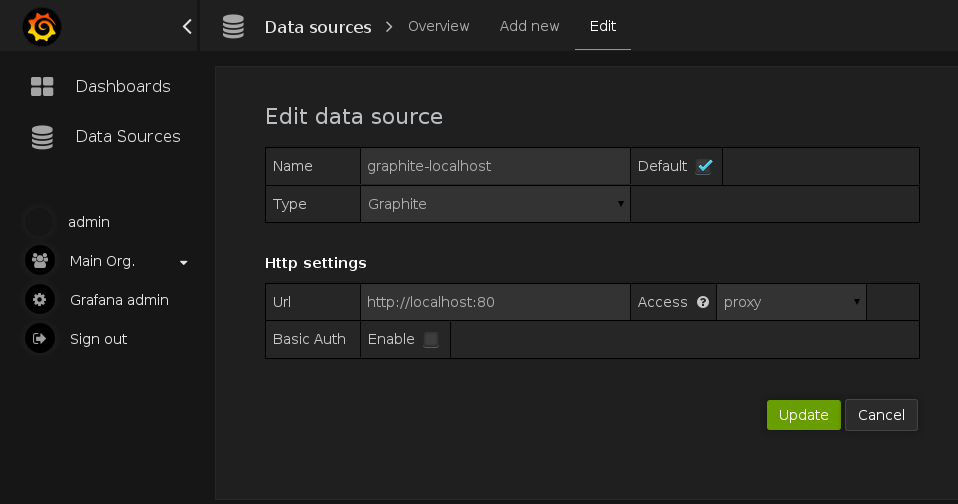

Vagrant-graphite-cluster

This is a vagrant environment to illustrate how to setup graphite in a cluster using the refactored puppet module from the inuits internal tree.
This vagrant environment will setup 4 nodes with a static ip, as the config for graphite-web explicitly wants ip addresses.
  - graphite-web     192.168.1.101
  - graphite-cache01 192.168.1.102
  - graphite-cache02 192.168.1.104
  - graphite-relay   192.168.1.103

Caution:
This is a very memory intensive setup, do not run on the old Dell machines!

How to:

git clone
git submodule update --init
vagrant up

Once the run is completed go to localhost:3000 for the grafana setup.
You will need to add the datasource manualy as that feature is not include in the config file as of grafana version 2.
Here is how to add it manualy:
Go to localhost:3000
Log in with the default credentials (admin:admin)
Click on the grafana icon.
Click on datasources.
Click add new. (on the top bar)
Under 'Add datasource':
Give it a name: graphite-localhost for example.
Check the default box.
Under 'Http settings':
url: http://localhost:80

Then click the green 'add' button.
That's it.
Now I include a example dashboard:
Got to dashboards.
Click 'home' on the top bar.
Click 'import'
Under 'Import file':
Click 'Choose file' and browse to where you put the vagrant folder.
Then in the files directory select the 'Graphite_cluster_stats-example_dashboard-grafana' file.
Enjoy.

On the thinkpad T440s it takes about 15 min to complete the first vagrant up.
To speed up the process you can first up the graphite-relay, then do the graphite-cache01 and 02 in parallel and as last the graphite-web node.
